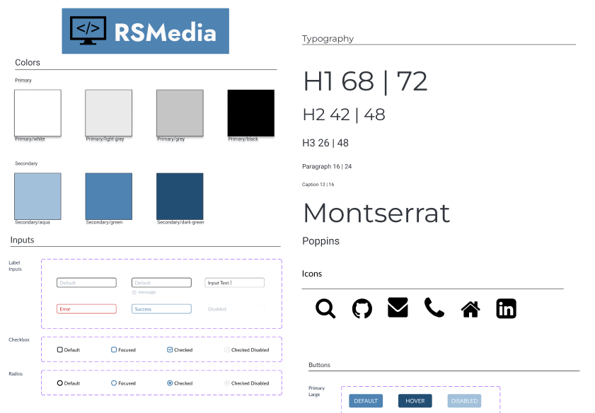
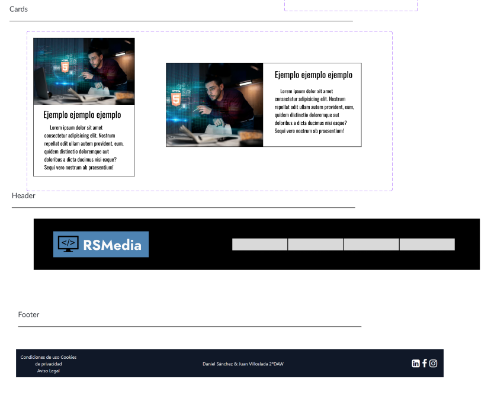
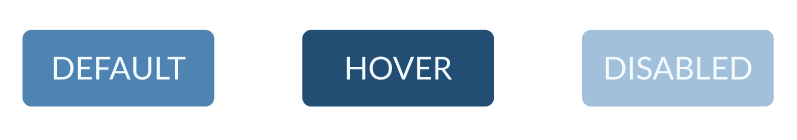
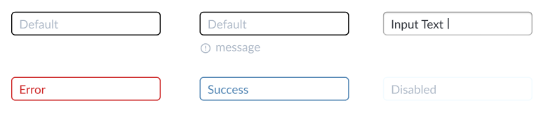
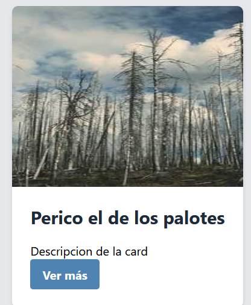
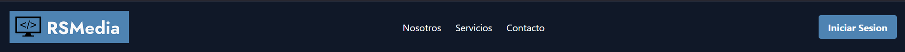

# Práctica 5.1: Creación de un Sistema de Diseño e Implementación en React + Tailwind CSS

En esta práctica, hemos desarrollado un sistema de diseño basado en los wireframes creados en la [Práctica 4.1.](https://www.figma.com/design/wVp8c4drg3ekrAwQ56zL8p/Empresa-dise%C3%B1o?node-id=0-1&t=uKXAPWifFQPEpdmR-1) Se ha estructurado y documentado el sistema en Figma y posteriormente implementado en un proyecto de React con TypeScript, utilizando Tailwind CSS para la estilización.

Para la presentación de este proyecto presentaremos nuestro sistema de diseño elegido, haciendo incapié en los componentes que utilizaremos con sus variantes. También mostraremos la implementación de los estilos con Tailwind CSS, la implementación de los distintos componentes con React para terminar con una lista de recursos de interés.

- [Proyecto en Figma](https://www.figma.com/design/wVp8c4drg3ekrAwQ56zL8p/Empresa-dise%C3%B1o?node-id=67-43&t=uKXAPWifFQPEpdmR-1)
- [Repositorio de Github](https://www.figma.com/design/wVp8c4drg3ekrAwQ56zL8p/Empresa-dise%C3%B1o?node-id=67-43&t=uKXAPWifFQPEpdmR-1)


## Índice

1. Definición del Sistema de Diseño

2. Componentes elegidos

3. Implementación de estilos con Tailwind CSS

4. Implementación de componentes con React

5. Enlaces de interés


## 1. Definición del [Sistema de Diseño](https://www.figma.com/design/wVp8c4drg3ekrAwQ56zL8p/Empresa-dise%C3%B1o?node-id=67-43&t=uKXAPWifFQPEpdmR-1)





## 2. Componentes elegidos

Los componentes que hemos decidido crear con React en nuestro proyecto son Button, Input y Card con sus variantes, asi como Header y Footer, componentes de mayor tamaño y entidad.

### Button



### Input



### Card



### Header



### Footer


## 3. Implementación de estilos con TailwindCSS

Ejemplo de implementación de estilos con TailwindCSS en los componentes

```Typescript
function Button({ text, variant = "default", onClick }: ButtonProps) {
  const variants: Record<Variant, string> = {
    default: "bg-blue-prim hover:bg-dark-blue",
    hover: "bg-gray-500 hover:bg-gray-700",
  };

  return (
    <button
      className={` ${variants[variant]} text-white font-bold py-2 px-4 rounded cursor-pointer`}
      onClick={() => {
        onClick(text);
      }}
    >
      {text}
    </button>
  );
}
```

También se han implementado estilos creados propios a TailwindCss en el archivo index.css con @theme

```css
@theme {

  /* Typography */
  --lineheight-caption: 1rem;
  --lineheight-parrafo: 1.5rem;
  --lineheight-h3: 2.625rem;
  --lineheight-h2: 3rem;
  --lineheight-h1: 4.5rem;
  --font-text-size-caption: 0.75rem;
  --font-text-size-parrafo: 1rem;
  --font-text-size-h3: 1.625rem;
  --font-text-size-h2: 2.625rem;
  --font-text-size-h1: 4.25rem;
  /* string */
  --font-parrafos: Poppins;
  --font-titulos: Oswald;

/* Icons */

  --small: 1.25rem;
  --medium: 1.875rem;
  --big: 3.125rem;

/* Colors */

  --color-error: rgb(205 36 36);
  --color-black: rgb(0 0 0);
  --color-dark-grey: rgb(197 197 197);
  --color-grey: rgb(234 234 234);
  --color-white: rgb(255 255 255);
  --color-blue-prim: rgb(78 131 178);
  --color-dark-blue: rgb(35 78 116);
  --color-light-blue: rgb(162 192 218);
}

```

## 4. Implementación de componentes con React

Más arriba hemos visto un ejemplo de componente de react. Aquí mostramos otro, esta vez la Card

```Typescript
import Button from './Button';

interface CardProps {
  imageSource: string;
  title: string;
  description: string;
}
function Card({ imageSource, title, description }: CardProps) {
  return (
    <div className="bg-white rounded-lg shadow-md w-full overflow-hidden">
      </img>
      <div className="p-6">
        <h2 className="text-2xl font-bold text-gray-800 mb-4">{title}</h2>
        <p>{description}</p>
        <Button text="Ver más" variant="default" onClick={(text) => console.log(text)} />
      </div>
    </div>
  )
}

export default Card

```

## 5. Enlaces de interés

- [Proyecto en Figma](https://www.figma.com/design/wVp8c4drg3ekrAwQ56zL8p/Empresa-dise%C3%B1o?node-id=67-43&t=uKXAPWifFQPEpdmR-1)
- [Repositorio de Github](https://www.figma.com/design/wVp8c4drg3ekrAwQ56zL8p/Empresa-dise%C3%B1o?node-id=67-43&t=uKXAPWifFQPEpdmR-1)

# React + TypeScript + Vite

This template provides a minimal setup to get React working in Vite with HMR and some ESLint rules.

Currently, two official plugins are available:

- [@vitejs/plugin-react](https://github.com/vitejs/vite-plugin-react/blob/main/packages/plugin-react/README.md) uses [Babel](https://babeljs.io/) for Fast Refresh
- [@vitejs/plugin-react-swc](https://github.com/vitejs/vite-plugin-react-swc) uses [SWC](https://swc.rs/) for Fast Refresh

## Expanding the ESLint configuration

If you are developing a production application, we recommend updating the configuration to enable type aware lint rules:

- Configure the top-level `parserOptions` property like this:

```js
export default tseslint.config({
  languageOptions: {
    // other options...
    parserOptions: {
      project: ['./tsconfig.node.json', './tsconfig.app.json'],
      tsconfigRootDir: import.meta.dirname,
    },
  },
})
```

- Replace `tseslint.configs.recommended` to `tseslint.configs.recommendedTypeChecked` or `tseslint.configs.strictTypeChecked`
- Optionally add `...tseslint.configs.stylisticTypeChecked`
- Install [eslint-plugin-react](https://github.com/jsx-eslint/eslint-plugin-react) and update the config:

```js
// eslint.config.js
import react from 'eslint-plugin-react'

export default tseslint.config({
  // Set the react version
  settings: { react: { version: '18.3' } },
  plugins: {
    // Add the react plugin
    react,
  },
  rules: {
    // other rules...
    // Enable its recommended rules
    ...react.configs.recommended.rules,
    ...react.configs['jsx-runtime'].rules,
  },
})
```
